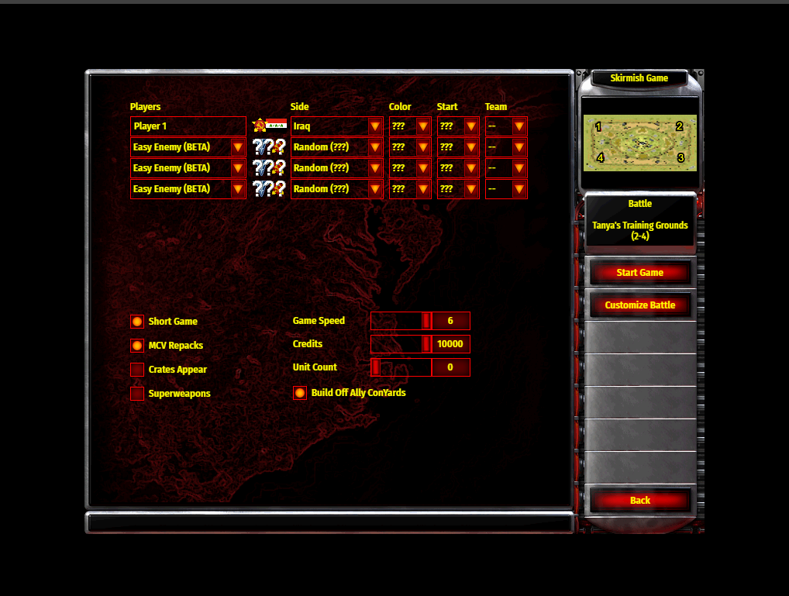

# Red Alert 2

This project aims to recreate the experience of playing the classic real-time strategy game Red Alert 2 in an online format. It adopts a learning and research-oriented approach by conducting reverse engineering to obtain images of the code required for the online version.

### How To Play?

- **Accessing the Game:** Players can access the game through [this URL](https://html-online-game.github.io/red-alert2/) using the Chrome browser.

- **Downloading the Game:** Upon first play, users need to download the game file. They can then select the downloaded file, which will take a few minutes to load.

- **Demo Mode:** The game offers a demo mode with easy enemies for players to practice and get acquainted with the gameplay.

- **Controls:** Players can control the game using both mouse and keyboard inputs.

### Disclaimers

The creator of this description explicitly states that they have not participated in the project and do not assume any risk or responsibility for its usage. Users should be aware of this disclaimer before engaging with the game.

### Original Project and Author

- **Original Project:** The original project repository can be found at [webra2.github.io](https://github.com/webra2/webra2.github.io).

- **Original Author:** The project was created by [webra2](https://github.com/webra2).